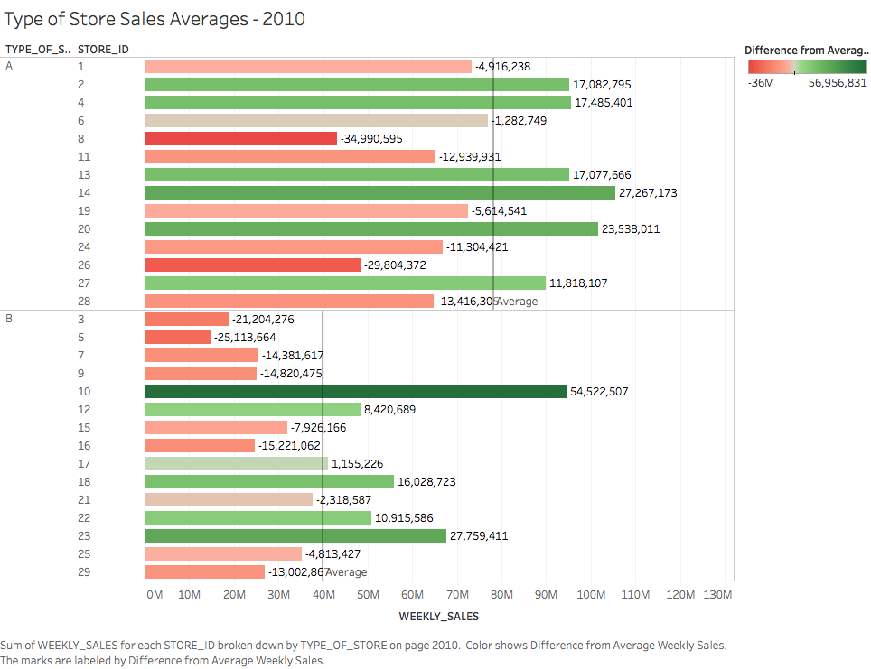
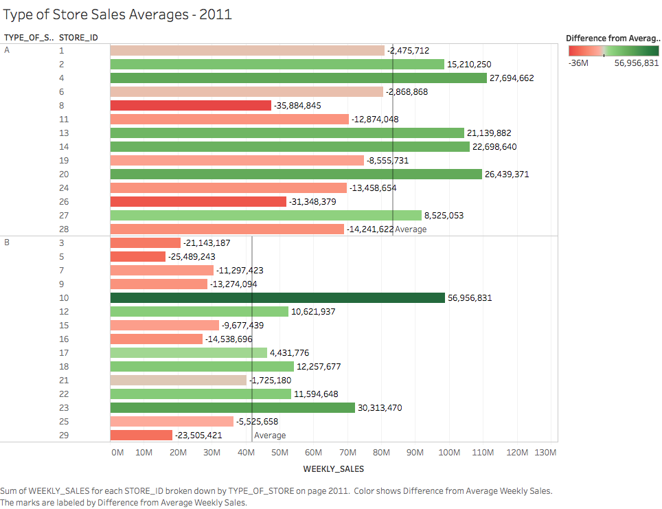
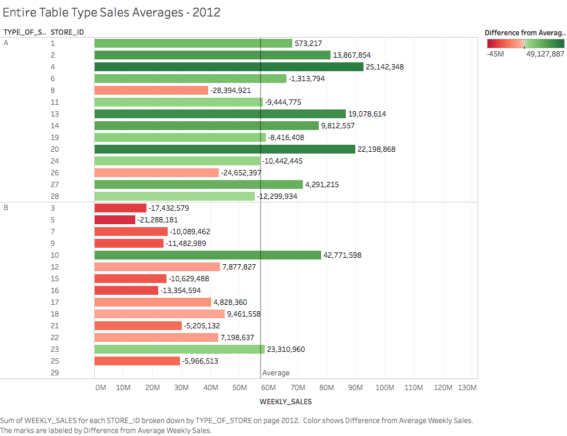
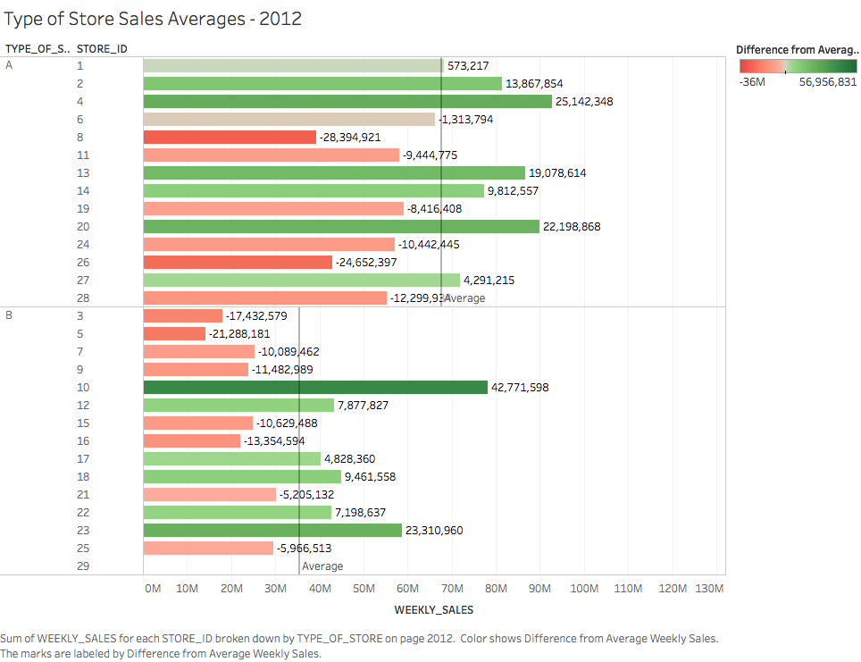

## Session Info

```{r}
sessionInfo()
```

## Finding & Processing Data

### STEP 1: Find a dataset. 

Public datasets are available on sites such as the [United States Census Bureau](http://www.census.gov/), [Reddit](https://www.reddit.com/r/datasets), and [UCI](https://archive.ics.uci.edu/ml/datasets/).

In this case, we a found a set of data that Walmart published for Kaggle, a data science competition site, that includes store information, historic weekly sales, miscillaneous factor that includes sale for 45 stores. The original data set is published [here](https://www.kaggle.com/c/walmart-recruiting-store-sales-forecasting/data).

Unlike the data set we used previously, the data is broken into many files/tables. The three tables that we used for this project are:

+ stores.csv (includes anonymized information about the stores)
+ train.csv (incldues historical training date from 2010-02-05 to 2012-11-01) 
+ features.csv (includes misc. information related to store, department, regional activity for each week)

Here's the description for each column name in the data file.

##### Train.csv

Name of Column | Description
------------- | -------------
Store | the store number
Dept | the department number
Date | the week
Weekly_Sales | sales for the given department in the given store
IsHoliday | whether the week is a special holiday week
```{r}
read.csv("../01 Data/train.csv", stringsAsFactors = FALSE, nrows=50)
```

##### Stores.csv

Name of Column | Description
------------- | -------------
Store | the store number
Type | type of store
Size | size of store
```{r}
read.csv("../01 Data/stores.csv", stringsAsFactors = FALSE, nrows=50)
```

##### Features.csv

Name of Column | Description
------------- | -------------
Store | the store number
Date | the week
Temperature | average temperature in the region
Fuel_Price | cost of fuel in the region
MarkDown1-5 | anonymized data related to promotional markdowns that Walmart is running. MarkDown data is only available after Nov 2011, and is not available for all stores all the time. Any missing value is marked with an NA.
CPI | the consumer price index
Unemployment | the unemployment rate
IsHoliday | whether the week is a special holiday week

```{r}
read.csv("../01 Data/features.csv", nrows=50, stringsAsFactors = FALSE)
```

### STEP 2: Clean up the data Using Extract, Transform, and Load techniques.

The process of ETL is straightforward. We read in the file, figure out what columns are considered dimensions and measured and process numbers as needed.

After running the R_ETL script, we copy & paste the cat(sql) result and run it in SQL Developer to create new tables. One thing to note that some names are not valid as column names in SQL to we changed them. For example, Store is renamed to Store_Id, Date is renamed to Date_of_Week, and so on. In addition, the R_ETL also outputs a reformatted version where the data is cleaned up nicely to meet the standards for importing to SQL database, which we then use to import in the databse. At this stage, it's neccessary to also match the old column names to the new column names we dictated when we first create the empty table.

```{r}
source("../01 Data/Data.R", echo = TRUE)
```


### STEP 3: Plot Data With Tableau

The SQL query used to gather data from all three tables using inner join in Tableau is a little bit different from the sql query for R.

```
select walmart_train.store_id, 
walmart_train.dept, 
TO_DATE(walmart_train.DATE_OF_WEEK,'YYYY-MM-DD') as real_date,
walmart_train.DATE_OF_WEEK,
walmart_train.isholiday, 
walmart_train.weekly_sales, 
walmart_stores.type_of_store, 
walmart_stores.size_of_store, 
walmart_features.fuel_price,
walmart_features.temperature,
walmart_features.cpi,
walmart_features.unemployment
from walmart_train, walmart_stores, walmart_features
where walmart_train.store_id = walmart_stores.store_id
and walmart_train.store_id = walmart_features.store_id
and walmart_train.DATE_OF_WEEK = TO_CHAR(TO_DATE(walmart_features.DATE_OF_WEEK,'MM/DD/YYYY'), 'YYYY-MM-DD')
```

This way we can have a comprehensive way of viewing the weekly sales data as long as all the other factors that could have affected it.

Also note that in order to not run into any error in Tableau, we have made a another column called **real_date** column where we convert the format of the string to YYYY-MM-DD. If not, we will run into an error where Tableau has a problem transforming and retrieving data with the query.

#### Sets: Weekly Sales Average by Type of Store

For our set calcuation, we created a set with the top 5 stores with the highest weekly sales. We did so by first plotting the average weekly sales per store through bar charts, select the top 5 stores with the highest bars, and create a set out of it. 
Then we plot the sales vs. time with the set as a filter to compare.


We also used Cross Table to visualize how sales per department perform against the Consumer Price Index by normalizing the sales. In this visualization, we broke it down by Store and Department, color it by Sales/CPI, and labeled using Weekly Sales. The picture below is a quick graphical visual.


The same plot is shown here, but with weekly sales value.


Here is the corresponding shiny code.
```
  output$crosstabPlot2 <- renderPlot({
    
    if (input$inSet == 'all') {
      d4 <- df
    }
    else if (input$inSet == 'top') {
      d4 <- df %>% filter(STORE_ID %in% top_n_stores)
    }
    else {
      d4 <- df %>% filter(STORE_ID %in% not_top_n)
    }
  
    ggplot(d4, aes(TYPE_OF_STORE, STORE_ID)) +
      labs(title='Weekly Average Sales based on Store ID and Holiday For Store')+
      geom_tile(aes(fill = WEEKLY_SALES), colour = "grey50") +
      geom_text(size = 3, aes(fill = floor(WEEKLY_SALES), label = floor(WEEKLY_SALES)))
  })
```

#### Table Calculation: Weekly Sales Average by Type of Store

For our table calculation, we wanted to compare the weekly sales average for each type of store to the average of each store within that type. 

To do this, we created a bar graph separating the stores into their respective Type, either A or B, and calculated the average sales for each pane. Then, we created the following table calculation: SUM([WEEKLY_SALES])-WINDOW_AVG(sum([WEEKLY_SALES])) which calculates the window average for each pane that we just plotted, and subtracts it from the sales for each store.




These graphs will allow us to see how a particular store compares to stores that are similar to it in order to analyze its weekly sales more fairly. For example, below are the 2012 graphs for weekly sales by type of store.



In this first graph, it appears that Store 12 is performing poorly at below the average.



However, when we compare Store 12 to similar Type B stores, it is actually out-performing most of the other stores. This would not be noticed in just comparing the sales to the overall table average. However, by calculating the average for each pane, we were able to notice this.

Here is the corresponding shiny code.
```
output$tableCalc <- renderPlot({
    require("jsonlite")
    require("RCurl")
    require(ggplot2)
    require(dplyr)
    require(shiny)
    require(gridExtra)
    

    
    df <- readRDS("../01 Data/walmart_data.rds")
    df$YEAR <- substr(df$DATE_OF_WEEK, 0, 4)

    if (input$year == '2010') {
      df <- df %>% filter(YEAR == '2010')
    }
    else if (input$year == '2011') {
      df <- df %>% filter(YEAR == '2011')
    }
    else {
      df <- df %>% filter(YEAR == '2012')
    }
    df$SALES_PER_CPI = as.numeric(df$WEEKLY_SALES) + as.numeric(df$CPI)
    names(df)
    summary(df)
    
    avg_sales_df <- df %>% group_by(STORE_ID, TYPE_OF_STORE) %>% summarise(SUM_OF_SALES=sum(WEEKLY_SALES)) %>% arrange(desc(SUM_OF_SALES))
    
    store_A <- (avg_sales_df %>% filter(TYPE_OF_STORE == "A"))
    store_B <- (avg_sales_df %>% filter(TYPE_OF_STORE == "B"))
    
    avg_sales_A <- mean(store_A$SUM_OF_SALES)
    avg_sales_B <- mean(store_B$SUM_OF_SALES)
    
    avg_sales_df$AVG_SALE_OF_TYPE <- ifelse(avg_sales_df$TYPE_OF_STORE == "A",avg_sales_A, avg_sales_B)
    avg_sales_df$DIFFERENCE <- avg_sales_df$SUM_OF_SALES-avg_sales_df$AVG_SALE_OF_TYPE
    
    ggplot(avg_sales_df, aes(x = STORE_ID, y=SUM_OF_SALES,fill=DIFFERENCE)) +
      labs(title='Type of Store Sales Averages')+ xlab("Store") + ylab("Sum of Sales") +
      geom_bar(stat = "identity") + coord_flip() + facet_wrap(~TYPE_OF_STORE) + scale_fill_gradient2(low=("red3"),high=("green4"))  + geom_text(aes(label=round(DIFFERENCE,0)), hjust=+.65)
    
  })
```
